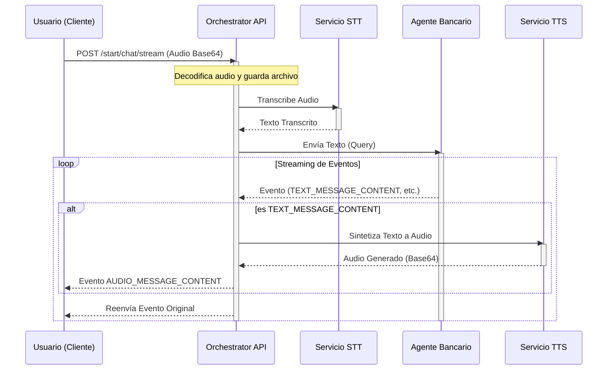
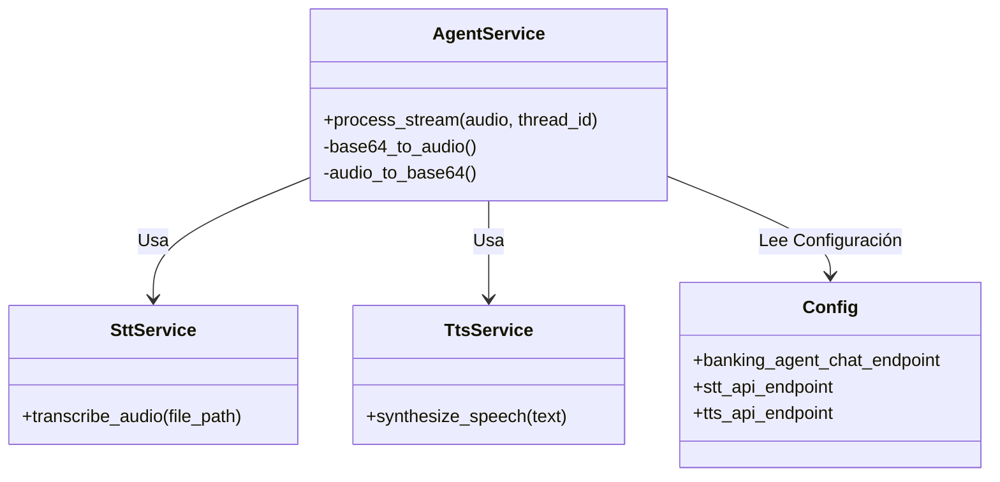

# Orchestrator API

Este microservicio actúa como un orquestador central para la demostración de Banca Agentica (`Agentic Banking Demo`). Su función principal es facilitar la interacción multimodal (voz y texto) entre el usuario y el Agente Bancario.

El servicio recibe entrada de audio, la transcribe a texto (STT), envía la consulta al Agente Bancario, y convierte la respuesta de texto del agente nuevamente a audio (TTS), transmitiendo todo el flujo de eventos en tiempo real al cliente mediante Server-Sent Events (SSE).

## 🗂️ Sistema de Archivos

```text
orchestrator_api/
├── .env                # Variables de entorno
├── requirements.txt    # Dependencias del proyecto
└── src/
    ├── main.py         # Punto de entrada de la aplicación FastAPI
    ├── api/
    │   └── routes/
    │       ├── agent.py    # Endpoint principal de chat/streaming
    │       └── health.py   # Endpoint de verificación de salud
    ├── core/
    │   ├── config/
    │   │   └── settings.py # Configuración cargada desde .env
    │   └── logger.py       # Configuración de logging
    ├── models/
    │   ├── agent_models.py # Modelos de Pydantic para el Agente
    │   ├── stt_models.py   # Modelos para STT
    │   └── tts_models.py   # Modelos para TTS
    ├── services/
    │   ├── agent_service.py # Lógica core de orquestación
    │   ├── stt_service.py   # Cliente para servicio Speech-to-Text
    │   └── tts_tervice.py   # Cliente para servicio Text-to-Speech
    └── files/               # Almacenamiento temporal de archivos de audio
```

## 🚀 Funcionalidades Principales

1.  **Procesamiento de Voz Bidireccional:**
    -   Recibe audio en formato Base64 desde el cliente.
    -   Utiliza servicios externos para la transcripción (STT) y síntesis de voz (TTS).

2.  **Orquestación con Agente Bancario:**
    -   Actúa como intermediario, manteniendo el estado de la conversación (thread_id).
    -   Maneja eventos complejos del protocolo `ag-ui-protocol`.

3.  **Streaming de Eventos (SSE):**
    -   Utiliza Server-Sent Events para enviar respuestas en tiempo real.
    -   Transmite eventos de texto, llamadas a herramientas y audio generado.

## 🛠️ Instalación y Configuración

### Prerrequisitos
- Python 3.9+
- Servicios externos de STT/TTS y Banking Agent corriendo.

### Pasos
1.  **Clonar el repositorio y navegar al directorio:**
    ```bash
    cd orchestrator_api
    ```

2.  **Crear un entorno virtual:**
    ```bash
    python -m venv .venv
    source .venv/bin/activate  # En Windows: .venv\Scripts\activate
    ```

3.  **Instalar dependencias:**
    ```bash
    pip install -r requirements.txt
    ```

4.  **Configurar variables de entorno:**
    Crea un archivo `.env` basado en el ejemplo:
    ```ini
    SERVER_NAME=Orchestrator API
    SERVER_VERSION=1.0.0
    PORT=8080
    API_PREFIX=/api
    BANKING_AGENT_CHAT_ENDPOINT=http://localhost:4000/api/start/chat/stream
    TTS_API_ENDPOINT=http://localhost:8000/api/to/speech
    STT_API_ENDPOINT=http://localhost:8000/api/to/text
    ```

5.  **Ejecutar el servidor:**
    ```bash
    uvicorn src.main:app --reload --port 8080
    ```

## 📡 Documentación de API

### `POST /api/start/chat/stream`
Inicia o continúa una sesión de chat con streaming de audio y texto.

**Body (JSON):**
```json
{
  "audio": {
    "audio_base64": "...",
    "mime_type": "audio/webm"
  },
  "thread_id": "optional-uuid",
  "resume": null
}
```

**Respuesta:**
Stream de eventos SSE (`text/event-stream`).

### `GET /api/health`
Verifica el estado del servicio.

## 📊 Diagramas de Arquitectura

### Flujo de Orquestación (Sequence Diagram)

Este diagrama muestra cómo viaja la petición de audio del usuario a través del sistema y vuelve como respuesta de audio.



### Componentes del Sistema


